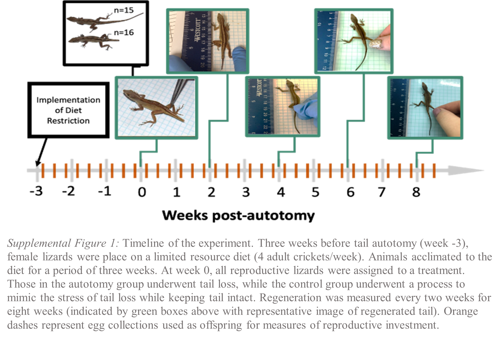

# Tails-of-Reproduction: Regeneration leads to increased reproductive investment
Abby E Beatty, David J Mote, & Tonia S Schwartz

This repository holds all supplemental files for "Tails of Reproduction:  Regeneration leads to increased reproductive investment".

## Abstract: 
"Tradeoffs between life-history traits are predicted due to limited resource allocation or constraints in the regulation of genetic and physiological networks. Life history theory suggests that investment into regenerating tissue may lead to a tradeoff with life-history traits, such as reproduction, but previous research has shown contradicting results. Tail autotomy, with subsequent regeneration, is a common anti-predation mechanism in lizards. In this study, we utilize the brown anole lizard with its relatively unique reproductive pattern, of single-egg clutches every 7-10 days, to test for a tradeoff in reproductive investment over eight weeks of tail regeneration on a limited diet. In contrast to our hypothesis, we found that investing in tissue regeneration had a positive effect on reproduction in terms of egg and hatchling size, and no effect on egg number or survival. Specifically, relative to the first four weeks of regeneration, during the last four weeks regenerating females produced 7.6% larger eggs and 17.2% heavier hatchlings; further, relative to controls, regenerating females produced 11.7% larger eggs and 11.5% heavier hatchlings. We discuss these results in the context of mechanistic hypotheses that the process of regeneration may cause increased metabolic efficiency or utilized shared physiological pathways with reproductive investment."

### Quick Key to File Directory: Detailed Descriptions of file use can be found below.
File Type | &nbsp;
------------------------------------ | -----------------------------------------------------
Raw Data                             | [All Data](AllData_Uncleaned.xlsx)
&nbsp;                               | [Maternal Measures](Regeneration.csv)
&nbsp;                               | [Hatchling Measures](Hatchling_Measures.csv)
&nbsp;                               | [Diet Measures](maternal.mass.csv)
Statistical Code                     | [Code](Regneration_publication.code.final.Rmd)
&nbsp;                               | [Code output](Regneration_publication.code.final.html)
Supplemental Figure Downloads        | [Supplemental Figure 1](SFig1_Github.png)
&nbsp;                               | [Supplemental Figure 2](SFig2_Github.png)
&nbsp;                               | [Supplemental Figure 3](SFig3_Github.png)
&nbsp;                               | [Supplemental Figure 4](SFig4_Github.png)
&nbsp;                               | [Supplemental Table 1](STable1_Github.png)

## Statistical Modeling and Data: 

The statistical analyses were performed in R (version 3.5.1) using [downloadable code](Regneration_publication.code.final.Rmd) in an R Markdown format. [Code output](Regneration_publication.code.final.html) displays all statistical models, results, and figures produced. Note, you will have to download the HTML file to visualize the data output. 

Examples of required packages, statistical models, and plots used can be seen below. Note: These are generalized examples produced for ease of adaptation. [Downloadable code](Regneration_publication.code.final.Rmd) contains the specific models used for publication, and the output can be found in the [Code output](Regneration_publication.code.final.html).

```ruby
#Required Packages
library(multcomp)
library(ggplot2)
library(nlme)
library(grid)
library(Rmisc)
library(gridExtra)
library(emmeans)
library(cowplot)

#Linear Mixed Models
#Run linear model comparing variable of interest across time including Maternal ID as a random effect variable
model=(lme(Dependent_Variable~Independent_Variable, data=dat, na.action=na.omit, random=~1|MaternalID))
#Run an anova output to display F-values and P-values
anova(model)

#Run EmMeans package to get pairwise comparisons of Independent Variables (Times or Treatments)
model.em=emmeans(model, list(pairwise ~ Independent_Variable), adjust = "tukey")
#Report adjusted means and P-values
model.em
#Report confidence intervals from EmMeans model
confint(model.em)

#Graph patterns using ggplot2 package
plot=ggplot(data=dat, aes(x=Independent_Variable, y=Dependent_Variable, fill=Independent_Variable)) + geom_violin(trim=F) + 
geom_boxplot(width=0.2, color="black") + geom_point (position=dodge, shape=1) + scale_fill_manual(values= c('gray62','darkslategray', 'darkseagreen2')) +
  xlab('x_IndependentVariable_Title') +
  ylab('y_DependentVariable_Title')
```

## Supplementary Figures: 



