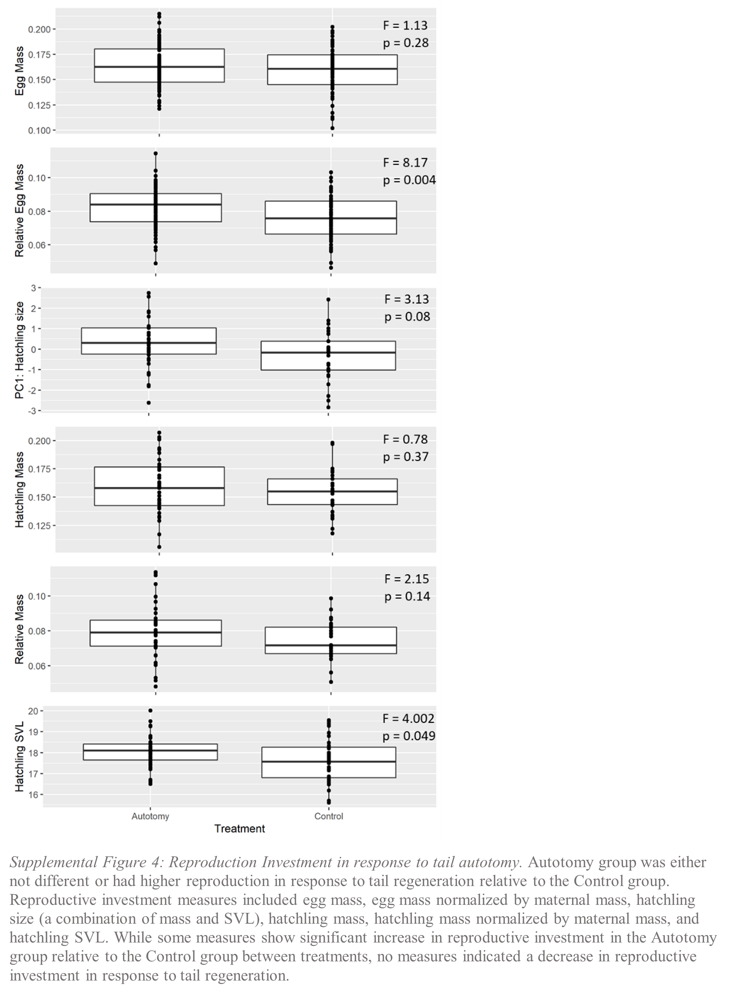
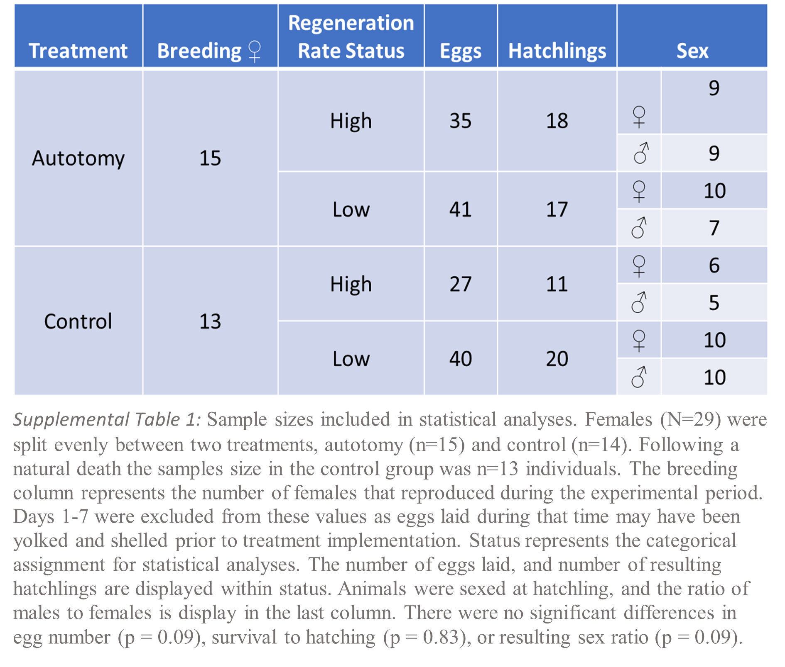

# Tails-of-Reproduction: Regeneration leads to increased reproductive investment
Abby E Beatty, David J Mote, & Tonia S Schwartz

This repository holds all supplemental files for "Tails of Reproduction:  Regeneration leads to increased reproductive investment".

## Abstract: 
"Tradeoffs between life-history traits are predicted due to limited resource allocation or constraints in the regulation of genetic and physiological networks. Life history theory suggests that investment into regenerating tissue may lead to a tradeoff with life-history traits, such as reproduction, but previous research has shown contradicting results. Tail autotomy, with subsequent regeneration, is a common anti-predation mechanism in lizards. In this study, we utilize the brown anole lizard with its relatively unique reproductive pattern, of single-egg clutches every 7-10 days, to test for a tradeoff in reproductive investment over eight weeks of tail regeneration on a limited diet. In contrast to our hypothesis, we found that investing in tissue regeneration had a positive effect on reproduction in terms of egg and hatchling size, and no effect on egg number or survival. Specifically, relative to the first four weeks of regeneration, during the last four weeks regenerating females produced 7.6% larger eggs and 17.2% heavier hatchlings; further, relative to controls, regenerating females produced 11.7% larger eggs and 11.5% heavier hatchlings. We discuss these results in the context of mechanistic hypotheses that the process of regeneration may cause increased metabolic efficiency or utilized shared physiological pathways with reproductive investment."

### Quick Key to File Directory: Detailed Descriptions of file use can be found below.
File Type | &nbsp;
------------------------------------ | -----------------------------------------------------
Supplemental Methods and Result      | [Supp Methods](Supplemental_Methods_and_Results.docx) 
Raw Data                             | [All Data](AllData_Uncleaned.xlsx)
&nbsp;                               | [Maternal Measures](Regeneration.csv)
&nbsp;                               | [Hatchling Measures](Hatchling_Measures.csv)
&nbsp;                               | [Diet Measures](maternal.mass.csv)
Statistical Code                     | [Code](Regeneration_publication.code.final.Rmd)
&nbsp;                               | [Code output](Regeneration_publication.code.final.html)

## Methodology: 

### General Husbandry 
Adult A. sagrei lizards (n = 48 females, n = 54 males) were collected from Palm Coast, Florida in April of 2018. The lizards were transported to Auburn University in Auburn, AL and acclimated to experimental conditions for three weeks (**Supp. Fig.1**). Each lizard was housed individually in a cage (15.25”L x 11.5”W x 11.75” H) on a 12:12 hour light/dark cycle at ~29°C in a temperature controlled room. Experimental conditions mimicked summer temperatures at the collection site, stimulating breeding and egg production.  Each cage contained reptile cage carpet, two bamboo perches, artificial greenery, and a nesting pot filled with a ~1:1 ratio of soil and peat moss. Lizards were provided UV illumination with Arcadia D3 + 12% UVB T5 Bulbs (Reptile Basics). 

### Resource-limited Control Diet  
All lizards were acclimated to a resource limited diet of two crickets (relative to ad lib of 5 crickets weekly), supplemented with vitamin and calcium dust, twice weekly.  This led to the halt of reproduction in eleven (of 40 females) females. For these individuals, food supply was increased to 5 crickets per week, however, they did not resume reproduction. In order to not compound tradeoffs due to diet restriction with those due to tail regeneration, individuals that stopped reproduction due to diet restriction were excluded from the study, adjusting the sample size to N=30. The [data depicting results of weight loss](maternal.mass.csv) show that the limited diet decreased the mean (F = 3.70; p = 0.06) and variance (var = 4.96; p = 0.002) of maternal mass before the experimental period (**Supp. Fig. 3A**). There were no differences in [maternal mass](Regeneration.csv (F = 0.018; p = 0.89) and [snout-vent length](Regeneration.csv) (SVL) (F = 0.85; p = 0.36) between treatments at the time of tail autotomy. Additionally, there was no difference in percent weight loss between treatments over the study period (F = 0.19; p = 0.66; **Supp. Fig. 3B** & **Supp. Fig. 3C**).

### Experimental Design 
We used females that had no evidence of prior tail loss or regeneration. Females were randomly assigned to one of two treatment groups, Control and Autotomy (n=14 and n=15 respectively; **Supp. Table 1**) female body size was not different between groups (mass p = 0.892; SVL p = 0.448). One female assigned to the control group died of natural causes, decreasing the sample size to n=13 individuals at the start of the experiment. Males can store sperm for many months, but to ensure a supply of sperm through the experiment, males (N=10) were randomly assigned as a mate to a set of three females.  Females were strategically assigned a shelf-location based on their mate, alternating Control and Autotomy females. During both the acclimation period and the experimental period, to ensure each female had a supply of sperm for egg fertilization, a mate was provided to each female once every 14 days for 24 hours. Males were housed separately from females at all other times so they would not compete with the females for resources. Males were always removed before feeding.  Death over the experimental period lead to Control and Autotomy samples sizes of n=13 and n=15 respectively. Individuals with partial regeneration period collections were used in analyses.

### Induction of Autotomy 
For the Autotomy group, lizards were placed on a flat surface and forceps were used to apply even pressure 2cm below the base of the tail. While pressure was applied to the tail, the lizard was able to move freely. This process continued until the lizard utilized its natural breakpoints to release the tail. The entire process was completed in less than one minute. Collected tails were measured and weighed, then flash frozen in liquid nitrogen and stored at -80°C.  To mimic the stress of tail autotomy in the Control group, individuals were removed from their housing and pressure was applied to the hind leg for a period of 30 seconds.  

### Measuring Regenerative Investment
SVL, tail length and mass [measurements](Regeneration.csv) were taken immediately preceding and following autotomy. Every 14 days the length (mm) of newly regenerated tail was measured along with SVL and mass.  

### Measuring Reproductive Investment 
After tail autotomy, egg collection continued for 8 weeks. Nesting pots were checked three times weekly (Monday, Wednesday, and Friday). Eggs were weighed and incubated at 27°C in a 6cm petri dish half filled with vermiculite (1:1.20 vermiculite:water ratio) and incubated to hatching. Egg [measures](Regeneration.csv) of maternal investment included: egg number (F = 0.08, p = 0.88), incubation duration (F = 1.93, p = .017), egg mass (F = 0.226, p = 0.63), survival (F = 0.07, p = 0.78). Hatchling [measures](Hatchling_Measures.csv) of maternal investment included: hatchling SVL (F = 4.00, p = 0.04), hatchling mass (F = 0.78, p = 0.37) and sex ratio (F = 0.001, p = 0.97).

### Statistical Analysis 
Hatchling SVL and hatchling mass were highly correlated (r = 0.511; p = 1.91e-5) and a Principle Component Analysis found that 75.53% of the variation was explained by the first principal component (**Supp. Fig. 4**). Egg mass was normalized by maternal mass to account for relative maternal investment to eggs and used as a dependent variable in analyses. 

Reproductive investment was first analyzed across the eight-week time period for treatment differences. The first seven days of offspring data was excluded from all analyses, as eggs laid during that time may have been yolked and shelled prior to treatment implementation. Reproductive investment was then evaluated categorically between time periods defined as Low and High, referring to the rate of regeneration. Peak tail regeneration rate occurred at week 4, then decreasing dramatically at weeks 6 and 8 (**Fig. 2A**). Therefore, days 8-28 (weeks 1-4) were grouped as “High”, while days 28+ were grouped as “Low”.

Linear mixed models were used to test for differences in reproductive investment between treatment groups. Maternal ID was included as a covariate in all models. The loadings of hatchling size PC1, which was termed “hatchling size”, and relative egg mass were used in linear models testing for differences in the two regeneration rate periods (High and Low) for the Autotomy group and the Control group. Tukey-based post-hoc analyses were performed to compare each of the regeneration status groups to the Control group. Correlations were run between maternal measures, including regeneration rate and mass, as well as offspring measures with maternal mass.

The statistical analyses were performed in R (version 3.5.1) using [code](Regeneration_publication.code.final.Rmd) in an R Markdown format. [Code output](Regeneration_publication.code.final.html) displays all statistical models, results, and figures produced. Note, you will have to download the HTML file to visualize the data output. 
  
### Estimating Maternal Age
Females were wild caught animals and we were unable to account for age during regeneration. It is possible that there are differential strategies of investment in these two processes to maximize lifelong fitness. The use of wild animals in this study means that all study individuals had been exposed to biologically relevant stressors related to the necessity of tail regeneration, such as predation. While we cannot be sure about the age of the experimental animals, previously collected data from wild caught animals was used to estimate age. Based on their size, it was estimated that 28 of the females were one year of age (first year of reproduction), while 2 individuals were likely two years of age. This makes it unlikely that the variation in our results is due to age alone. 

## Supplemental Figures and Tables 
  
&nbsp; 
&nbsp; 
 
&nbsp; 
&nbsp; 
 
&nbsp; 
&nbsp; 

&nbsp; 
&nbsp; 
 
&nbsp; 
&nbsp; 

